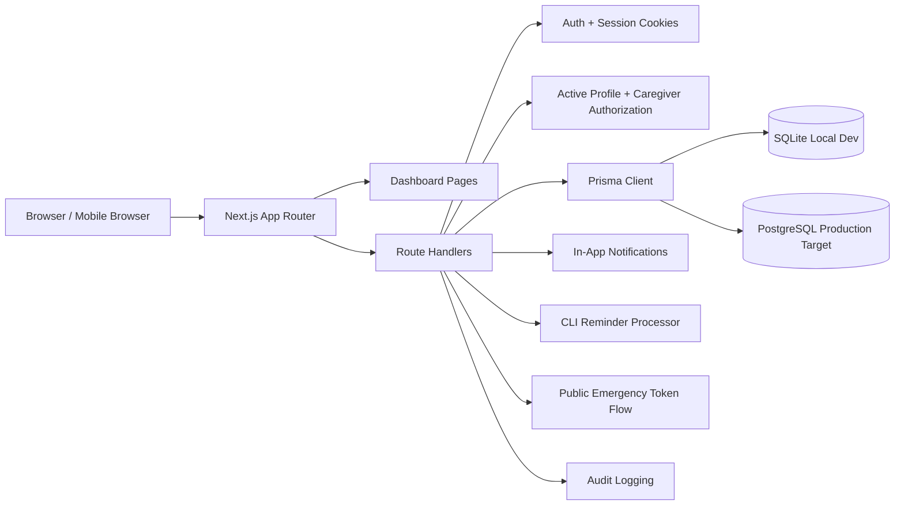
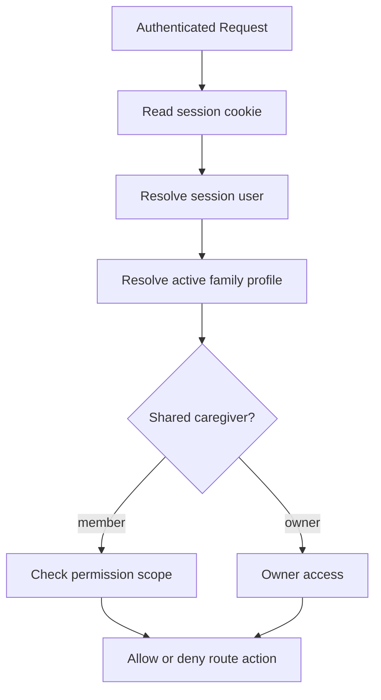
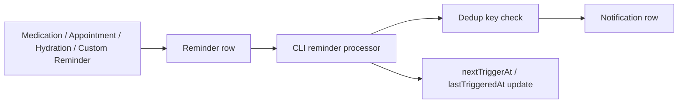
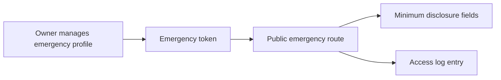

# Architecture

## High-Level System

## Authorization and Profile Access

## Reminder to Notification Flow

## Emergency Token Flow

## Actual Layers

- **Next.js application**: App Router pages and route handlers.
- **Frontend/dashboard layer**: profile-aware dashboard and domain pages.
- **API route layer**: CRUD and workflow endpoints.
- **Auth/session layer**: JWT session cookie plus active-profile cookie.
- **Shared caregiver authorization**: permission checks in `src/lib/authorization.ts`.
- **Prisma data layer**: one Prisma Client over SQLite locally and PostgreSQL in production.
- **Reminder processing service**: CLI script `npm run reminders:process`.
- **Notification system**: in-app notification rows and unread counts.
- **Public emergency flow**: token-based read-only disclosure page.
- **Audit logging**: server-side audit trail for sensitive actions.
- **Isolated auth test DB**: separate SQLite DB created for auth regression tests.
- **Migration replay verifier**: isolated SQLite replay with a precreated file for deterministic deploy/status checks.
